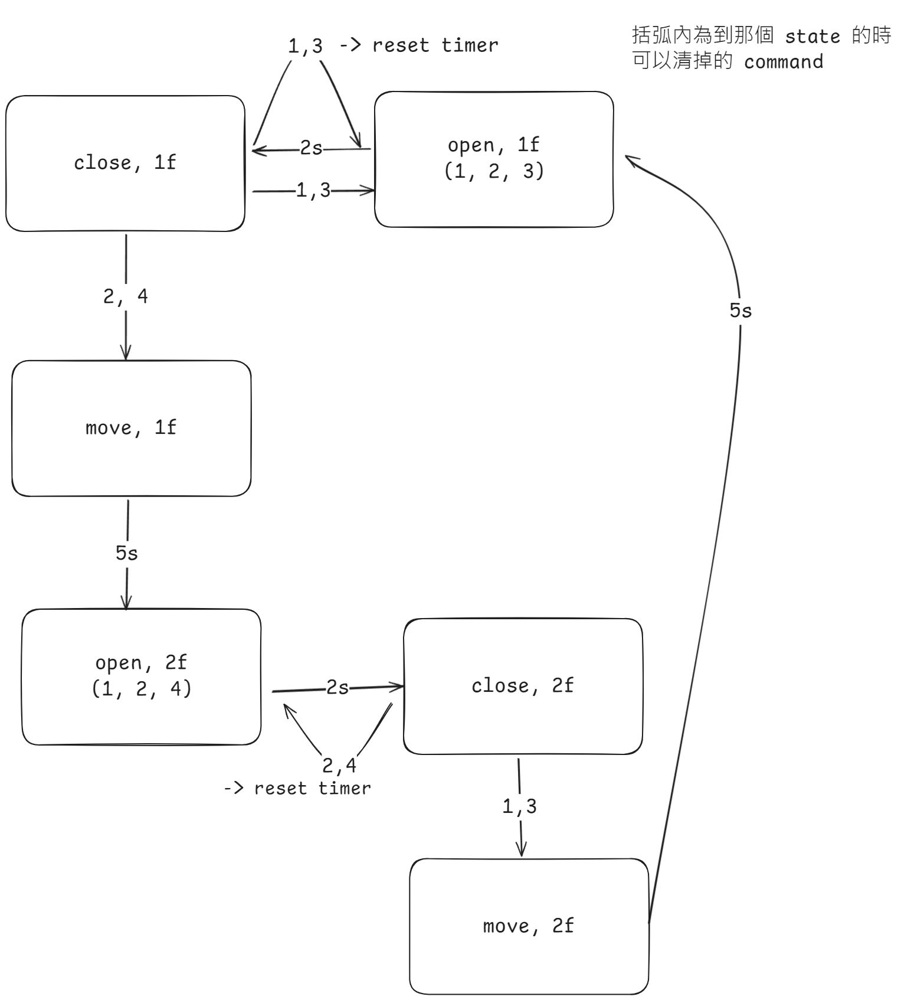
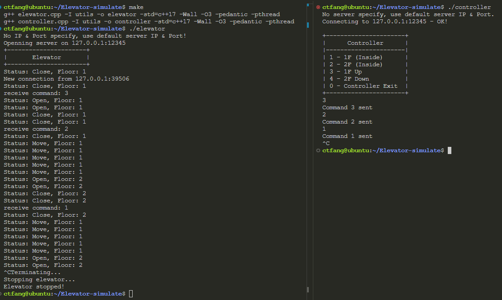

# Elevator-simulate

## Overview

This project simulates an elevator system controlled via TCP socket communication. 

The system consists of two main components:

- **Controller**: Sends commands to the elevator.

- **Elevator**: Simulates the operation of the elevator, processing commands received from the controller.


## Feature

- **Elevator States**: The elevator can be in one of three states - Close, Open, Move.

- **Command Interface**: The controller sends commands to the elevator simulation to control its operation.

- **TCP Communication**: The controller and elevator simulation communicate using TCP sockets.

- **State Diagram**


## Components

### Controller

The controller program sends commands to the elevator simulation. 

Commands are mapped as follows:
- `1`: Command to go to the 1st floor from inside the elevator.
- `2`: Command to go to the 2nd floor from inside the elevator.
- `3`: Command that 1st floor want to go up.
- `4`: Command that 2nd floor want to go down.

### Elevator
The elevator simulation processes the commands received from the controller and updates its state accordingly. 
It simulates the elevator's operation and prints its state every second.


## Compile 
```
$ make
g++ elevator.cpp -I utils -o elevator -std=c++17 -Wall -O3 -pedantic -pthread
g++ controller.cpp -I utils -o controller -std=c++17 -Wall -O3 -pedantic -pthread
```

And there will compile to two executable files: ```elevator``` & ```controller```!


## Controller 

### Usage
```sh
$ ./controller <ElevatorIP> <ElevatorPort>

Eg:
./controller 127.0.0.1 12345
```

#### Example 
```
$ ./controller 
No server specify, use default server IP & Port.
Connecting to 127.0.0.1:12345 - OK!
+----------------------+
|      Controller      |
|----------------------|
| 1 - 1F (Inside)      |
| 2 - 2F (Inside)      |
| 3 - 1F Up            |
| 4 - 2F Down          |
| 0 - Controller Exit  |
+----------------------+
```

## Elevator

### Usage
```sh
$ ./elevator <ListenIP> <ListenPort>

Eg:
./elevator 127.0.0.1 12345
```

#### Example 
```
$ ./elevator
No IP & Port specify, use default server IP & Port!
Openning server on 127.0.0.1:12345
+----------------------+
|       Elevator       |
+----------------------+
```

## Notes
- Ensure that the server (elevator simulation) is running before starting the client (controller).

## Acknowledgements
This project uses C++ standard libraries and the POSIX socket API for networking.

## Demo 
 